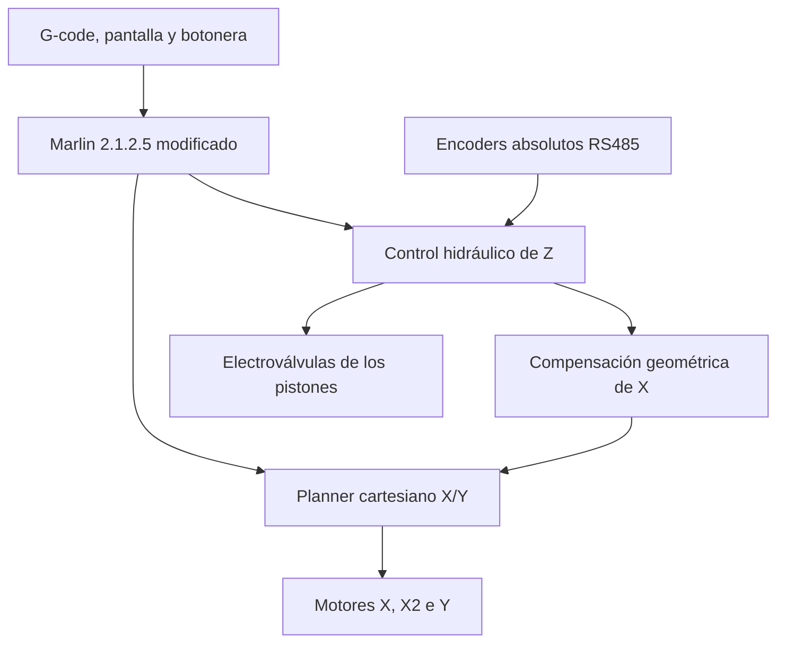
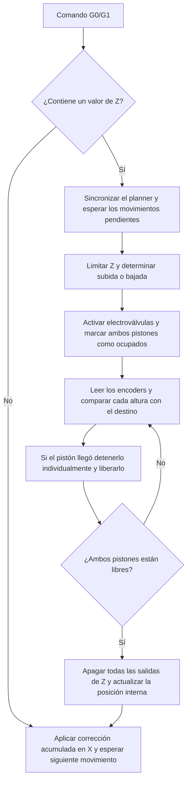

<p align="center">
  
</p>

<h1 align="center">Firmware Marlin para impresora 3D de viviendas</h1>

<p align="center">
  Adaptación de <strong>Marlin 2.1.2.5</strong> para una impresora de gran escala con movimiento cartesiano X/Y y un eje Z hidráulico realimentado por encoders absolutos.
</p>

<p align="center">
  
  
  
  <a href="LICENSE"></a>
</p>

<p align="center">
  Desarrollado por <strong>Baltazar Patané</strong> como parte de la Práctica Profesional Supervisada de Ingeniería en Computación de la UNLP.
</p>

---

## Descripción general

Este repositorio conserva el intérprete G-code, el planificador de movimientos y la interfaz de usuario de Marlin, pero reemplaza el tratamiento convencional del eje Z por un control específico para la mecánica de una impresora 3D de viviendas.

Los desplazamientos X/Y se ejecutan mediante dos motores en X y uno en Y. La altura se obtiene con dos pistones hidráulicos independientes, accionados por electroválvulas y realimentados mediante encoders absolutos RS485. El firmware traduce las posiciones Z expresadas en milímetros a la altura física del mecanismo y compensa automáticamente el desplazamiento que el movimiento angular introduce sobre X.

> [!IMPORTANT]
> Este firmware fue calibrado para un prototipo específico. Antes de utilizarlo en otra máquina se deben verificar el mapa de pines, el sentido de los actuadores, los límites mecánicos, las tablas de calibración y el circuito físico de emergencia.

## Arquitectura del sistema



La separación entre coordenadas lógicas y físicas permite conservar archivos G-code cartesianos:

- La **posición lógica** es la coordenada solicitada por el usuario y mostrada en pantalla.
- La **posición física** incorpora la corrección necesaria para compensar la geometría angular del eje Z.
- Marlin continúa planificando X/Y de forma estándar y el control especial se aplica únicamente en los puntos intervenidos.

## Características principales

| Subsistema | Implementación |
| --- | --- |
| Movimiento X | Dos motores paso a paso gestionados con el soporte nativo de segundo motor de Marlin |
| Movimiento Y | Un motor paso a paso controlado por el planner cartesiano |
| Movimiento Z | Dos pistones hidráulicos con mando independiente de subida y bajada |
| Realimentación | Dos encoders absolutos conectados por RS485 mediante Modbus RTU |
| Conversión de altura | Funciones trigonométricas calibradas individualmente para cada encoder |
| Corrección geométrica | Tabla de 50 puntos e interpolación lineal para compensar X en función de Z |
| Arcos | Aplicación de la corrección acumulada sobre movimientos `G2/G3` y ajustes de continuidad entre segmentos |
| Interfaz | Pantalla RepRap Discount Full Graphic, tarjeta SD y menús de movimiento ampliados |
| Operación manual | Botonera física para X, Y y Z, con estabilización de los pistones por realimentación |
| Seguridad | Parada de emergencia, apagado explícito de electroválvulas e indicadores de estado |

## Funcionamiento del eje Z



La corrección utilizada en cada cambio de altura responde a:

```text
ΔX = corrección(Z nueva) - corrección(Z anterior)
```

El valor se acumula internamente para mover la estructura a la posición física correcta sin alterar la coordenada X lógica informada al usuario.

## Hardware y comunicaciones

| Elemento | Configuración |
| --- | --- |
| Unidad de control | ATmega2560 |
| Placa lógica | `BOARD_R3_Shield` |
| Comunicación con el host | Puerto serie principal a 115200 baudios |
| Bus de encoders | `Serial3`, RS485 a 9600 baudios |
| Protocolo | Modbus RTU con cálculo y verificación CRC16 |
| Área lógica configurada | X: -12000 a 12000 mm · Y: -6000 a 6000 mm |
| Límite de control del eje Z | 3400 mm |
| Resolución de movimiento | X: 47.7 pasos/mm · Y: 26.78 pasos/mm |

### Asignación principal de pines

| Función | Pines |
| --- | --- |
| Motor X | STEP 54 · DIR 55 · ENABLE 56 |
| Motor X2 | STEP 58 · DIR 57 · ENABLE 59 |
| Motor Y | STEP 60 · DIR 61 · ENABLE 63 |
| Pistón Z1 | DOWN 42 · UP 44 |
| Pistón Z2 | DOWN 46 · UP 48 |
| Control RS485 | DE/RE 2 |
| Indicadores | Verde 4 · Amarillo 5 · Rojo 6 |
| Botón de emergencia | 12 |
| Salidas auxiliares | Variador 11 · Clapeta 13 |

El mapa completo, incluidos la botonera, el display y la tarjeta SD, se encuentra en [`pins_R3_Shield.h`](Marlin/src/pins/board_propia/pins_R3_Shield.h).

## Indicadores y seguridad

| Elemento | Función |
| --- | --- |
| LED verde | Firmware inicializado y en ejecución |
| LED amarillo | Movimiento activo en X, Y o Z |
| LED rojo | Estado de parada por emergencia |
| Botón de emergencia | Detiene el planner, cambia los indicadores y lleva el firmware al estado de parada |
| `M112` | Apaga las cuatro salidas de los pistones antes de ejecutar la parada total de Marlin |

La parada implementada por software complementa al circuito de seguridad de la máquina; no lo reemplaza.

## Comandos G-code relevantes

| Comando | Comportamiento en esta adaptación |
| --- | --- |
| `G0` / `G1` | Ejecutan X/Y mediante el planner e interceptan Z para controlar los pistones con los encoders |
| `G2` / `G3` | Mantienen los movimientos circulares y trasladan el destino X lógico a su coordenada física corregida |
| `G28` | Pone en cero los encoders antes de comenzar el procedimiento de homing |
| `G29` | Informa X lógica, Y, Z y los ángulos actuales de ambos encoders |
| `G30 X… Y… A… B…` | Impone las coordenadas iniciales X/Y y los ángulos A/B para recuperar el estado de la máquina |
| `M0` / `M1` | Sincronizan el movimiento, llevan la salida auxiliar al estado de pausa y esperan la reanudación |
| `M3` / `M4` | Desactivan o activan la salida auxiliar asociada al variador/clapeta |
| `M112` | Apaga las electroválvulas y realiza la parada total |

Ejemplo de consulta y restauración de estado:

```gcode
G29
G30 X1250.0 Y840.0 A31.2 B31.0
```

Los valores del ejemplo son ilustrativos y deben reemplazarse por las coordenadas y ángulos obtenidos en la máquina.

## Pantalla y operación manual

La pantalla gráfica conserva los menús de Marlin y agrega incrementos de movimiento de **1000 mm** y **5000 mm**, adecuados para las dimensiones de la impresora. La coordenada X mostrada se corrige antes de convertirse a texto, por lo que representa la posición lógica de impresión y no el desplazamiento físico acumulado.

La botonera externa permite:

- desplazar X/Y mediante pequeños comandos `G1` encolados;
- accionar manualmente ambos pistones para subir o bajar Z;
- conservar y estabilizar la altura alcanzada al soltar los botones.

## Compilación y carga

### Requisitos

- Visual Studio Code.
- Extensión PlatformIO IDE.
- Cable USB y controladores correspondientes al ATmega2560.

### Procedimiento

1. Abrir la carpeta raíz del repositorio en Visual Studio Code.
2. Seleccionar el entorno PlatformIO `mega2560`.
3. Compilar el firmware:

   ```bash
   pio run -e mega2560
   ```

4. Conectar la controladora y cargarlo:

   ```bash
   pio run -e mega2560 -t upload
   ```

El archivo compilado se genera en `.pio/build/mega2560/firmware.hex`.

## Archivos clave

| Archivo | Responsabilidad principal |
| --- | --- |
| [`Configuration.h`](Marlin/Configuration.h) | Placa, comunicación, dimensiones, movimientos, display y constantes propias |
| [`Configuration_adv.h`](Marlin/Configuration_adv.h) | Funciones avanzadas, arcos, watchdog y control directo de pines |
| [`MarlinCore.cpp`](Marlin/src/MarlinCore.cpp) | RS485, encoders, inicialización, botonera, estabilización y emergencia |
| [`G0_G1.cpp`](Marlin/src/gcode/motion/G0_G1.cpp) | Control bloqueante de Z y compensación geométrica de X |
| [`G2_G3.cpp`](Marlin/src/gcode/motion/G2_G3.cpp) | Corrección y continuidad de movimientos circulares |
| [`planner.cpp`](Marlin/src/module/planner.cpp) | Estado compartido y accionamiento de los pistones |
| [`pins_R3_Shield.h`](Marlin/src/pins/board_propia/pins_R3_Shield.h) | Mapa de pines específico de la controladora |
| [`status_screen_DOGM.cpp`](Marlin/src/lcd/dogm/status_screen_DOGM.cpp) | Presentación de las coordenadas lógicas en pantalla |

Las intervenciones realizadas para esta máquina están señaladas en el código con la etiqueta `BALTA`, lo que facilita su localización y mantenimiento.

## Licencia y atribución

Este proyecto es una adaptación de [Marlin Firmware 2.1.2.5](https://github.com/MarlinFirmware/Marlin), desarrollado por la comunidad Marlin y basado a su vez en Sprinter y grbl. El logotipo original de Marlin Firmware fue diseñado por Ahmet Cem TURAN ([@ahmetcemturan](https://github.com/ahmetcemturan)).

Marlin is published under the [GPL license](LICENSE) because we believe in open development. The GPL comes with both rights and obligations. Whether you use Marlin firmware as the driver for your open or closed-source product, you must keep Marlin open, and you must provide your compatible Marlin source code to end users upon request. The most straightforward way to comply with the Marlin license is to make a fork of Marlin on GitHub, perform your modifications, and direct users to your modified fork.
